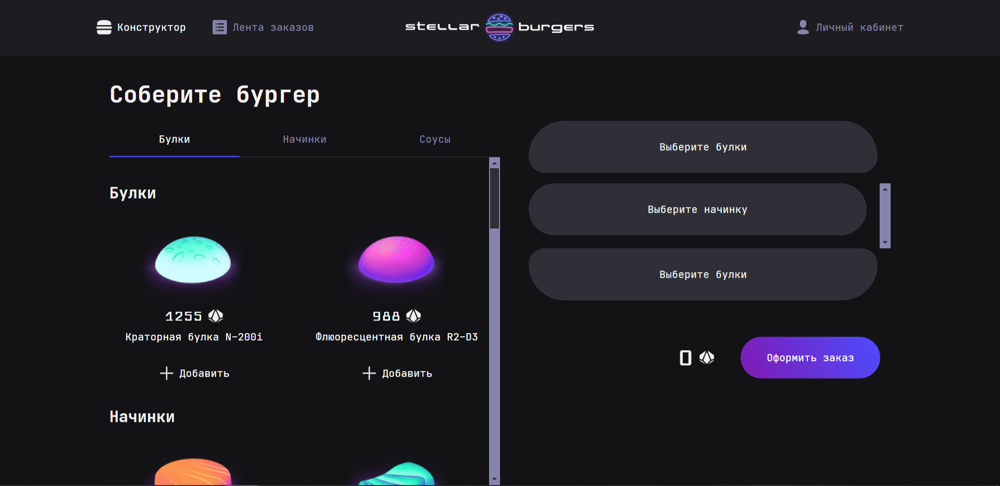

# 🍔 Stellar Burgers

## Описание

Проект `Stellar Burgers` — это веб-приложение, позволяющее пользователям собирать собственные уникальные бургеры из различных ингредиентов. Хотя эти бургеры и не самые полезные для организма, зато они точно оригинальные и вкусные!

Проект разработан как полноценное SPA (Single Page Application) с авторизацией, роутингом, управлением состоянием и защитой маршрутов.

---

## 💡 Используемые технологии

- **Create React App** – для быстрого старта и настройки окружения
- **TypeScript** – для типизации компонентов и утилитарных функций
- **Redux Toolkit** – для централизованного управления состоянием приложения
- **React Router v6** – для реализации клиентского роутинга
- **Axios** – для работы с API
- **Cookie** – для хранения токена авторизации
- **Cypress** – для функционального тестирования интерфейса
- **Jest** – для unit-тестирования логики и редьюсеров

---

## 🛠 Функционал

### Сборка бургера

- Пользователь может перетаскивать ингредиенты мышкой, чтобы создать свой идеальный бургер.
- Поддержка добавления булочек, начинок и соусов с правильной валидацией.

### Авторизация

- Страницы регистрации, восстановления пароля и сброса пароля.
- Хранение токена в cookie для автоматической авторизации.
- Защищённые маршруты, которые доступны только авторизованным пользователям.

### Личный кабинет

- Возможность просмотра истории заказов.
- Редактирование данных профиля.

### История заказов

- Просмотр деталей каждого заказа: состав, дата, статус.

### WebSocket (опционально)

- Отслеживание статуса заказа в реальном времени.

---

## 🔐 Защита и безопасность

- **Защищённые маршруты**  
  Доступ к страницам профиля и заказов возможен только после авторизации.

- **Токены в Cookie**  
  Для удобства и безопасности токен доступен только по HTTP (HttpOnly), предотвращая XSS-атаки.

---

## 🧪 Тестирование

### Юнит-тесты (Jest)

- Все редьюсеры и бизнес-логика протестированы с использованием Jest.

### Функциональное тестирование (Cypress)

- Протестированы основные пользовательские сценарии:
  - Авторизация
  - Создание бургера
  - Переход по защищённым маршрутам
  - Работа с модальными окнами

---

## 🛠 Как запустить проект локально

1. Склонируйте репозиторий:
   ```bash
   git clone https://github.com/ваше-имя/stellar-burger.git
   ```
2. Перейдите в папку проекта:

   ```bash
   cd stellar-burger
   ```

3. Установите зависимости:

   ```bash
   npm install
   ```

4. Запустите проект:
   ```bash
   npm start
   ```

## 🧪 Как запустить тесты

- Запуск юнит-тестов:
  ```bash
  npm test
  ```
- Запуск Cypress для функционального тестирования:
  ```bash
  npm run cypress:open
  ```

## Предварительный просмотр
